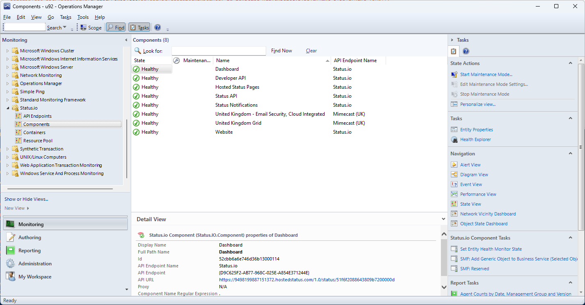
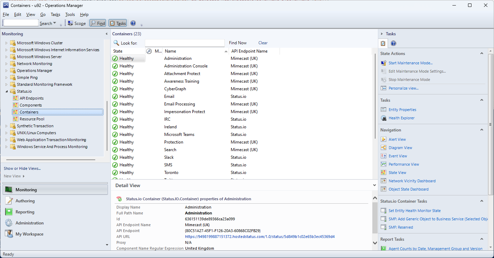

# Status.io Management Pack

## MP and Visual Studio Files
* [Download MP](MPS/Status.IO.mpb)
* [Visual Studio Solution File](Status.IO/)

## Introduction

[Status.io](https://status.io/) offer hosted system status pages, that use their API to publish the status of a service, e.g. [Status](https://status.status.io/). This MP allows you to monitor state published to a hosted system status page.

**Hosted Status Page**

**Status Monitored in SCOM**

## Configuration

### Adding a Hosted Status Page (API Endpoint)

Monitoring is performed by the **Status.io Monitoring Resource Pool**. To add a new Status.io hosted public status page use the **Add Status.io API Endpoint** Task. 

Override the task settings with the details for the hosted status page.

|Parameter|Description|
|-|-|
|URL|URL of hosted status public API. |
|Proxy|Http proxy to use to connect to the API endpoint. Proxy authentication uses windows authentication with the account associated with the **Status.io Monitoring Profile** Run As Profile.| 
|Component Name Regular Expression|Regular expression that components must match to be included in discovery and monitoring.|
|Container Name Regular Expression|Regular expression that containers must match to be included in discovery and monitoring.|

Once the task completed the newly added API Endpoint will be visible.

Once discovery runs against the API Endpoints (Default is every 4 hours) components and containers will be discovered and monitored.

### Changing Warning and Critical Status Codes

API Endpoints, Components, and Containers all have the same monitor type targeted at them. The monitor has overridable parameters for the regular expressions that must be match to set critical and warning states. 

|Parameter|Default Value|Description|
 |-|-|-|
|Critical Status Code Regular Expression|^5.*\|^6.*|Status codes that match the regular expression will generate critical health state.| 
|Warning Status Code Regular Expression|^2.*\|^3.*\|^4.*\|^999$|Status codes that match the regular expression will generate Warning health state

[API Status Codes](https://kb.status.io/developers/status-codes/)
 

### Removing API Endpoints

Simply use the **Remove Status.io API Endpoint** Task.

